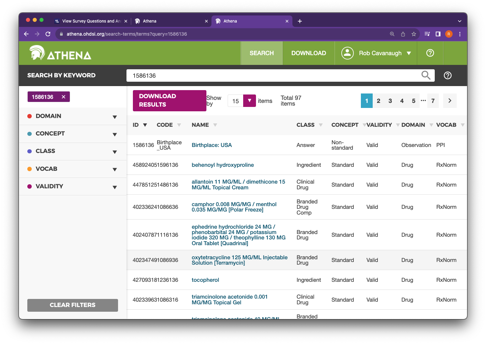

```{r, include = FALSE}
knitr::opts_chunk$set(
  collapse = TRUE,
  comment = "#>"
)
```

# Using the AllofUs data browser and R together

This vignette will go over how to use the AllofUs Research Data Browser to identify questions of interest, and then how to pull that data from the OMOP-CDM structured database. The Data Browser is a useful took for quickly finding data (survey questions, conditions in the electronic health record, fitbit measurements etc.). It can be found here: https://databrowser.researchallofus.org/ and is available publicly. However, it's not always clear exactly how to query the OMOP-CDM database to find the data that you can preview in the Data Browser.  

<div>

</div>

## Survey Data

### The Basics
Finding the question "In what country were you born?" and participants answers

<div>

</div>

We can see in the image above that the "Concept Code" for Birthplace USA is 1586136. This is a **Non-Standard** AllofUs specific code used to identify Birthplace: USA. We need to find the code for the question. An easy way to do this is to search for this code in Athena (https://athena.ohdsi.org/search-terms/start).

<div>

</div>

Clicking on Birthplace:USA reveals that it is in the **Observation** Domain, it is a question **Answer**, and is in the PPI Vocabulary (the vocabulary for AllofUs specific, non-standard codes). We also see that it has the PPI Parent Code of 1586135 "The Basics: Birthplace". This is the **non-standard** code for the question. We can also see the non-standard to Standard map (OMOP) For Birthlace code is 3005917. This is the **Standard** code for "Birthplace". 

<div>

</div>

To be successful finding AllofUs Data from the Data Browswer, it is really important to understand the difference between these **non-standard** and **standard** codes. 

- **non-standard** codes are specific to the AllofUs database. **Standard** codes are codes that could be found in any OMOP database. 
- **non-standard** codes are found in the **{table}_source_concept_id** columns. **standard** codes are found in the **{table}_concept_id** columns

Lets look at this survey question example. We can find our **question**, **non-standard** code 1586135 in the **observation table**. This is the AllofUs specific code for The Basics: Birthplace question in the observation_source_concept_id column. Here's a glimpse at the distinct responses for this code (note that I've omitted other important columns like `person_id` and `observation_date` and shown an aggregate row to comply with the AllofUs data sharing restrictions).


```{r eval = FALSE}
# start by connecting to the database
library(allofus)
library(dplyr)
con <- aou_connect()
```

```{r eval = FALSE}
tbl(con, "observation") %>%
    filter(observation_source_concept_id == 1586135) %>%
    head() %>% 
    distinct(observation_concept_id, observation_source_value,
           observation_source_concept_id, value_source_concept_id, value_source_value) %>%
    collect()
```

```{R, echo = FALSE}
tibble::tribble(
  ~ 'observation_concept_id', ~ 'observation_source_value', ~ 'observation_source_concept_id', ~ 'value_source_concept_id', ~ 'value_source_value',
  3005917, 'TheBasics_Birthplace', 1586135, 1586136, 'Birthplace_USA') |> 
  knitr::kable(align = "r") |> 
  kableExtra::kable_styling(bootstrap_options = "striped", full_width = TRUE, font_size = 10.5)
```

These columns match to the values we saw in Athena. We can see the **standard** concept ID for the Birthplace question in the `observation_concept_id` column. The `observation_source_value` and `observation_source_concept_id` columns hold the related **non-standard** codes for the question. Finally, we see where the survey responses are: the **non-standard** concept code we saw in the data browser is in the `value_source_concept_id` column and the text version of this code is in `value_source_value`.

