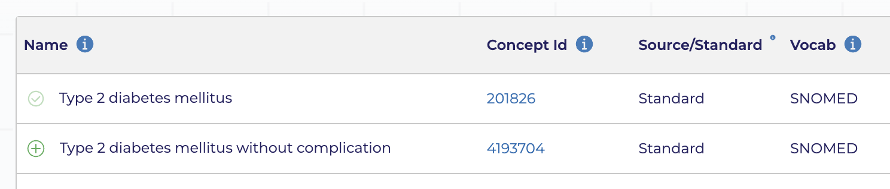
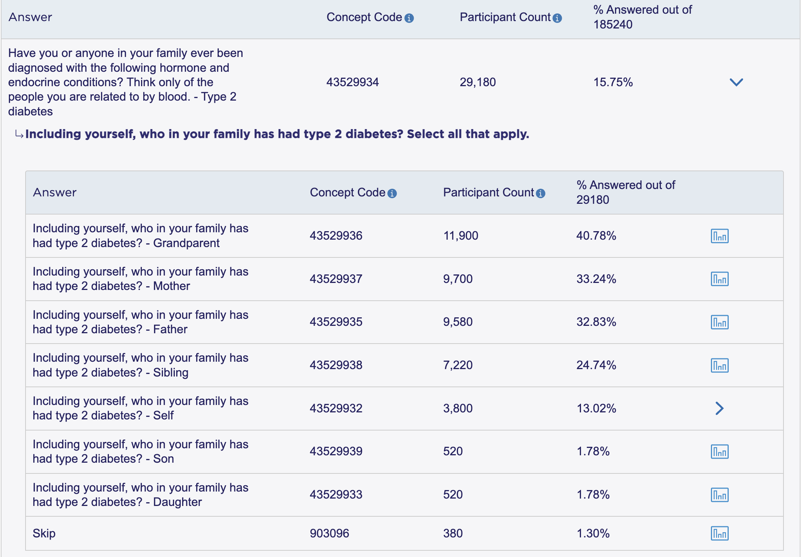

```{r, include = FALSE}
knitr::opts_chunk$set(
  collapse = TRUE,
  comment = "#>",
  eval = FALSE
)
```

The [Researcher Workbench](https://workbench.researchallofus.org/), available to registered All of Us researchers, provides tools for creating datasets using the All of Us database. Researchers first use the Workbench to create a cohort defined by values of survey variables (e.g., gender, race, age), observations from the electronic health record (e.g., diagnosis codes, lab values), data from wearable devices (e.g., fitbit), genomic data, and/or physical measurements. Data -- either predefined or user-specified [*concept sets*](https://www.researchallofus.org/faq/what-is-a-concept-set/) -- from each of the database tables can then be extracted for the cohort. More information on this process is available [here](https://support.researchallofus.org/hc/en-us/articles/4556645124244-Using-the-Concept-Set-Selector-and-Dataset-Builder-tools-to-build-your-dataset).

The `allofus` package takes a programmatic approach to extracting data from the All of Us database. One advantage to this approach is that it is easier to document and share the process. This is especially important for reproducibility and transparency. To demonstrate, this vignette will walk through some examples of extracting data from the All of Us database.

Suppose we want a cohort of the female All of Us participants who weren't born in the US. For this cohort, we want to extract data on their history of diabetes, their A1C lab values, and their use of metformin after joining All of Us.

## Survey data

The first step is extracting gender and country of birth from the survey data. We can retrieve these variables either by concept code or concept id. Using the `allofus` [searchable codebook](https://roux-ohdsi.github.io/allofus/articles/searchable_codebook.html), we find that the concept id for gender is 1585838 and for birthplace is 1586135. We can use the `aou_survey` function to extract these variables from the All of Us database. This function takes a vector of concept ids or codes, and returns a dataset with one row per participant and one column per variable. The `question_output` argument allows you to specify the names of the column in the output dataset. Alternatively, you can specify "concept_id" or "concept_code" to name the variables according to one of those options.

```{r}
library(allofus)
library(tidyverse)

svy_vars <- aou_survey(questions = c(1585838, 1586135), question_output = c("gender", "birthplace"))
```

```{r, echo = FALSE, eval = TRUE}
cli::cli_warn(c("No cohort provided.", ">" = "Pulling survey data for entire All of Us cohort."))
```

Note that the `aou_survey` function takes a cohort as an argument, with the only requirement that it contains a column called `person_id`. If no cohort is provided (e.g., if you are using survey data to define your cohort), the function will pull data for the entire All of Us cohort.

Because `aou_survey()` defaults to `collect = FALSE`, the query isn't fully executed yet, and we can continue to perform analyses, like cross-tabulating the two variables, on the database.

```{r}
count(svy_vars, gender, birthplace)
```

```         
#> # Source:   SQL [?? x 3]
#> # Database: BigQueryConnection
#>    gender            birthplace       n
#>    <chr>             <chr>      <int64>
#>  1 Skip              Skip          4449
#>  2 NA                NA              97
#>  3 Woman             USA         205440
#>  4 Woman             Other        40348
#>  5 Man               Skip          1484
#>  6 Transgender       USA            504
#>  7 PreferNotToAnswer USA            475
#>  8 PreferNotToAnswer Other          112
#>  9 Man               USA         131698
#> 10 Man               Other        21059
#> # ℹ more rows
```

To create our cohort, we can subset the data to the participants matching our criteria.

```{r}
cohort <- svy_vars %>%
  filter(gender == "Woman", birthplace == "Other")

cohort
```

```         
#> # Source:   SQL [?? x 5]
#> # Database: BigQueryConnection
#>    person_id birthplace gender birthplace_date gender_date
#>      <int64> <chr>      <chr>  <date>          <date>     
#>  1   xxxxxxx Other      Woman  2019-08-xx      2019-08-xx 
#>  2   xxxxxxx Other      Woman  2018-06-xx      2018-06-xx 
#>  3   xxxxxxx Other      Woman  2019-05-xx      2019-05-xx 
#>  4   xxxxxxx Other      Woman  2019-02-xx      2019-02-xx 
#>  5   xxxxxxx Other      Woman  2018-06-xx      2018-06-xx 
#>  6   xxxxxxx Other      Woman  2019-03-xx      2019-03-xx 
#>  7   xxxxxxx Other      Woman  2019-04-xx      2019-04-xx 
#>  8   xxxxxxx Other      Woman  2019-04-xx      2019-04-xx 
#>  9   xxxxxxx Other      Woman  2019-05-xx      2019-05-xx 
#> 10   xxxxxxx Other      Woman  2020-09-xx      2020-09-xx 
#> # ℹ more rows
```

Note that the `aou_survey()` function automatically creates an additional column for every survey variable extracted, which contains the date the participant answered the question. These are automatically named by adding "\_date" as a suffix to the column names.

## EHR data

Now that we have our cohort, we want to create a dataset with data from these participants' medical records. We first want to find the concept ids of the data we want to extract. There are a number of tools we could use to do so:

1.  [Athena](https://athena.ohdsi.org/): a web-based tool for searching the entire OMOP vocabulary. The concept id for Type 2 diabetes mellitus can be found under ID. There are many results for this search, but we want only standard concepts when searching for EHR data.

    {width="600"}

2.  [Data Browser](https://databrowser.researchallofus.org/): a tool for exploring data in the All of Us database. Finding the concept id for Type 2 diabetes mellitus requires searching for that concept and then clicking "Sources":

    {width="600"}

3.  [Researcher Workbench](https://workbench.researchallofus.org/): Creating a concept set can allow you to find a number of concept ids quickly. Add concepts to your concept set, and then review the concept set to see them all.

    {width="600"}

Here are some concepts we may want to include. Keep in mind that this is an example, and a real analysis would have a more thorough search for relevant concepts.

| Concept ID | Concept Name                                     | Domain      |
|------------|--------------------------------------------------|-------------|
| 201826     | Type 2 diabetes mellitus                         | Condition   |
| 4193704    | Type 2 diabetes mellitus without complication    | Condition   |
| 40164929   | metformin hydrochloride 500 MG Oral Tablet       | Drug        |
| 40164897   | metformin hydrochloride 1000 MG Oral Tablet      | Drug        |
| 3004410    | Hemoglobin A1c/Hemoglobin.total in Blood         | Measurement |
| 3005673    | Hemoglobin A1c/Hemoglobin.total in Blood by HPLC | Measurement |

First, we'll extract data on diabetes diagnoses. We can use the `aou_concept_set` function to extract data from the All of Us database. This function takes a cohort, a vector of concepts, and a domain or set of domains. You can actually extract data from multiple domains at once -- the default is to search all domains. However, it is helpful to specify the domain(s) when you can, for speed and clarity. The `output =` argument specifies the type of data to extract. Here, we'll extract an indicator variable for whether the participant has a diabetes diagnosis at any point in their medical record. We'll call that variable "t2dm".

```{r}
t2dm <- aou_concept_set(cohort,
  concepts = c(201826, 4193704),
  domains = "condition", output = "indicator",
  concept_set_name = "t2dm"
)
```

We can also extract data within a certain time window. For example, if we only want to extract metformin use after joining All of Us, we can specify a start date as the date the participant answered the gender question (on the Basics survey). We'll count how many times the participant was prescribed metformin after that time point.

```{r}
metformin <- aou_concept_set(cohort,
  concepts = c(40164929, 40164897),
  domains = "drug", output = "count",
  start_date = "gender_date", concept_set_name = "metformin"
)
```

For a concept set in the measurement domain, we likely want to set `output = "all"` because we are interested in the values of the measurements, not whether they had any or how many they had.

```{r}
a1c <- aou_concept_set(cohort,
  concepts = c(3004410, 3005673),
  domains = "measurement", output = "all", start_date = "gender_date"
)
```

The output to this is a dataset with one row per measurement. We can see that the second participant in the output has had 4 A1C measurements since joining All of Us, while the fifth had 1 and the rest had none.

```{r}
a1c
```

```         
#> # Source:   SQL [?? x 9]
#> # Database: BigQueryConnection
#>    person_id concept_date concept_id concept_name concept_domain value_as_number
#>      <int64> <date>          <int64> <chr>        <chr>                    <dbl>
#>  1   xxxxxx1 NA                   NA NA           NA                        NA  
#>  2   xxxxxx2 2022-03-xx      3004410 Hemoglobin … Measurement                5.6
#>  3   xxxxxx2 2021-07-xx      3004410 Hemoglobin … Measurement                5.6
#>  4   xxxxxx2 2021-05-xx      3004410 Hemoglobin … Measurement                5.5
#>  5   xxxxxx2 2020-10-xx      3004410 Hemoglobin … Measurement                6  
#>  6   xxxxxx3 NA                   NA NA           NA                        NA  
#>  7   xxxxxx4 NA                   NA NA           NA                        NA  
#>  8   xxxxxx5 2019-04-xx      3005673 Hemoglobin … Measurement                5.9
#>  9   xxxxxx6 NA                   NA NA           NA                        NA  
#> 10   xxxxxx7 NA                   NA NA           NA                        NA  
#> # ℹ more rows
#> # ℹ 3 more variables: value_as_concept_id <int64>, value_source_value <chr>,
#> #   gender_date <date>
```

## Health history survey data

Suppose we want to compare the EHR data to self-reported survey data on diabetes diagnoses. Returning again to the `aou_survey()` function, we need to first find the concept id for the question asking about diabetes diagnoses. Wuestions from the health history surveys are more complex than others like gender and birthplace: there are branching questions and complex skip patterns for each question, which were also asked about family members, and groups of diagnoses were asked about together. The searchable health history codebook is a useful tool for finding the concept id for these questions. We can search for "diabetes" and find the concept id for the question asking about type 2 diabetes diagnoses for the respondent: 43529932. We can also use the [Data Browser](https://databrowser.researchallofus.org/) to find the same concept id: {width="600"}

Data from the health history surveys is returned as "Yes", "No", or "Skip". An observation will have a value of "No" if the participant answered that someone in their family had the condition, but did not self-identify as having the condition, or if they responded that no one in their family had the condition. If they skipped either part of the question, the value will be "Skip".

```{r}
t2dm_self <- aou_survey(cohort, questions = 43529932, question_output = "t2dm_survey")
```

Next, we want to combine these datasets into one. We can do this using the `aou_join` function. This function takes a list of datasets and joins them together using the participant id. The `aou_join` function also allows you to specify the type of join (inner, left, right, or full). Here we'll perform repeated left joins into the cohort using the `reduce()` function from the `purrr` package.

```{r}
combined_data <- reduce(list(cohort, t2dm, metformin, a1c, t2dm_self),
  aou_join,
  type = "left"
)
```

Our combined dataset has columns for the diabetes diagnosis indicator from the EHR data, the number of metformin prescriptions, the self-reported diabetes diagnosis from the health history survey and the date that survey was completed, as well as complete data on the A1C measurements. Participants with multiple measurements therefore have multiple rows in the dataset. We may want to do some additional analyses before bringing the table off the database and into R. For example, we may want to summarize the A1C measurements as the highest value for each participant. We can continue to manipulate the data using `dplyr` functions (see `vignette("sql", package = "allofus")`).

```{r}
final_data <- combined_data %>%
  group_by(person_id, birthplace, t2dm, metformin, t2dm_survey) %>%
  summarize(max_a1c = max(value_as_number, na.rm = TRUE), .groups = "drop")
```

This final query may take a few seconds to run -- it is the accumulation of all the queries we've run so far (use `show_query()` to see the SQL query that will be run). For that reason, it is often helpful to print the result of each individual query to make sure it is what you expect before moving on to the next step.

```{r}
final_data
```

```         
#> # Source:   SQL [?? x 5]
#> # Database: BigQueryConnection
#>    person_id  t2dm metformin t2dm_survey max_a1c
#>      <int64> <dbl>     <dbl> <chr>         <dbl>
#>  1   xxxxxxx     0         0 NA             NA  
#>  2   xxxxxxx     0         0 DontKnow       NA  
#>  3   xxxxxxx     0         0 NA             NA  
#>  4   xxxxxxx     0         0 No             NA  
#>  5   xxxxxxx     0         0 NA             NA  
#>  6   xxxxxxx     0         0 NA             NA  
#>  7   xxxxxxx     0         0 NA             NA  
#>  8   xxxxxxx     0         0 No             NA  
#>  9   xxxxxxx     0         0 NA             NA  
#> 10   xxxxxxx     0         0 No              5.4
#> # ℹ more rows
```
